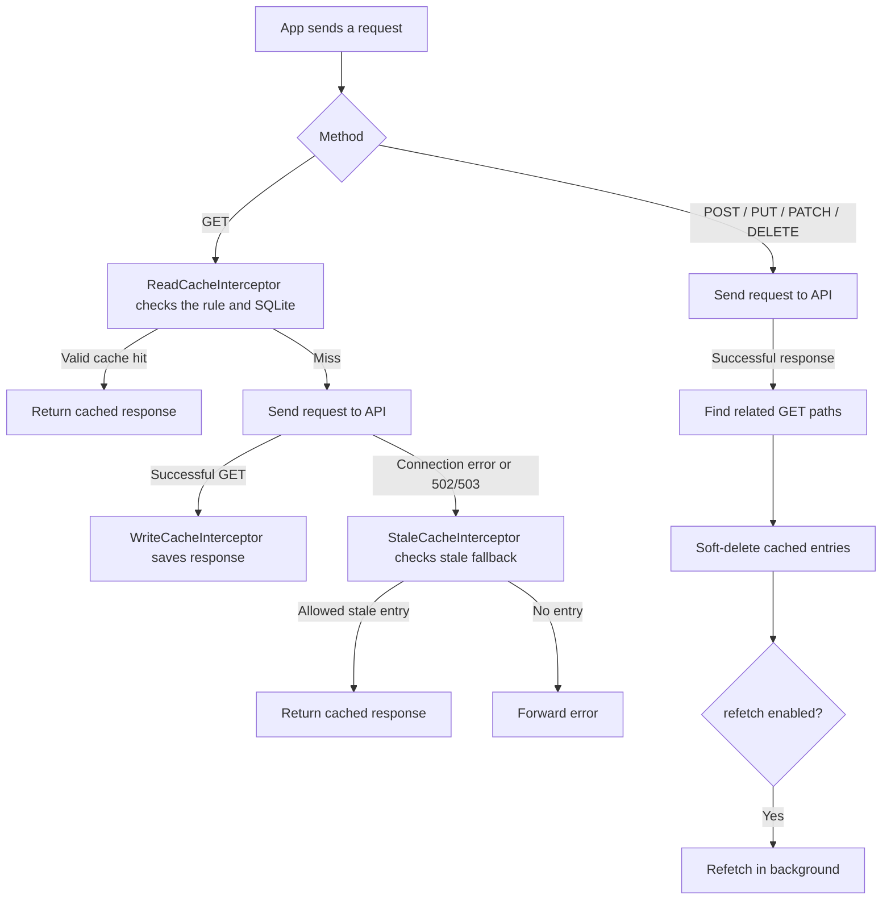

# Cache Graph

[English](README.md) | [Tiếng Việt](README.vi.md)

Cache Graph is a Flutter/Dio HTTP response cache built around interceptors. It stores selected GET responses in SQLite and uses relationships between write endpoints and GET endpoints to invalidate affected entries after a successful write request.

## Features

- Configure GET caching by endpoint, TTL, and scope. Use an explicit path list or `paths: ["*"]` for all GET endpoints. An explicit path rule takes priority over the wildcard rule.
- Serve valid cached responses before sending a network request.
- Fall back to an entry marked stale when a connection error or an HTTP `502`/`503` error occurs, if that entry allows stale responses.
- Invalidate related GET entries after successful `POST`, `PUT`, `PATCH`, or `DELETE` responses. Relationships can optionally match the write request body with a regular expression and trigger a background refetch.
- Refresh frequently used cache entries in the background after three hits for the same request key within one minute.
- Keep SQLite databases separate by the ID passed to `ApiCache.openDatabase` and apply configuration through callbacks that can return updated values at runtime.

## Cache rules

Each `ApiCacheConfig` defines `paths`, `scope`, optional TTL, and `allowStale`:

| Scope | When an entry is valid |
| --- | --- |
| `time` | Within a positive TTL. This is the default scope. |
| `appSession` | In the current app session; an optional TTL can end it sooner. |
| `loginSession` | In the current login session; an optional TTL can end it sooner. |

TTL can be supplied as `ttlSeconds`, `ttlMinutes`, or `ttlHours`. If more than one is present, the parser uses the first in that order. A cache entry also has to be newer than `clearBefore`, if that callback returns a date.

`paths` matches the request URL path, without query parameters. `paths: ["*"]` is a fallback rule for every GET path. If both wildcard and explicit rules match, the explicit rule wins.

## Request flow

A cache hit can also start a background refresh after the hit threshold. The current request still receives the cached response. Invalidation runs asynchronously after a successful write response; soft-deleted entries cannot serve a normal GET or stale fallback.

## Integration

The app-facing API is `ApiCache` in `lib/api_cache.dart`:

1. Call `ApiCache.configure(...)` to provide dynamic `isEnabled`, `configs`, `relationships`, and `clearBefore` getters, plus optional `reFetch` and logging callbacks.
2. Add `ApiCache.readCacheInterceptor`, `ApiCache.writeCacheInterceptor`, and `ApiCache.staleCacheInterceptor` to Dio in that order. Other app interceptors can be placed between them as needed.
3. After login, call `ApiCache.startLoginSession()` and `await ApiCache.openDatabase(id: userId)`.
4. When the relationship configuration changes, call `await ApiCache.updateApiCacheRelationshipsDatabase()` to reload the SQLite relationship table.
5. On logout, call `await ApiCache.closeDatabase()`.

`ApiCacheDelegate`, the database classes, and the session/startup classes are internal implementation details.

## Examples and diagrams

- [`config_sample/1_cache_config_simple.json`](config_sample/1_cache_config_simple.json): a wildcard rule for all GET paths.
- [`config_sample/2_cache_config_explicit_paths.json`](config_sample/2_cache_config_explicit_paths.json): explicit paths, different scopes, and invalidation relationships.
- [`docs/cache_graph_flow_raw_en.txt`](docs/cache_graph_flow_raw_en.txt): detailed English text flow.
- [`docs/cache_graph_flow_en.png`](docs/cache_graph_flow_en.png): English flow diagram.

The JSON files are examples. The current implementation receives configuration through `ApiCache.configure(...)` callbacks and does not load these files automatically.
