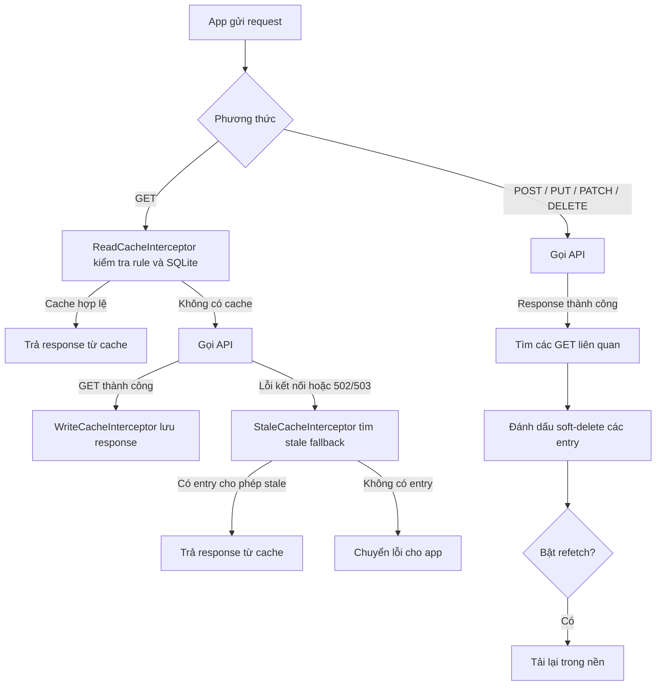

# Cache Graph

[English](README.md) | [Tiếng Việt](README.vi.md)

Cache Graph là bộ nhớ đệm HTTP response cho Flutter/Dio, hoạt động qua interceptor. Module lưu response của các GET được chọn vào SQLite và dùng quan hệ giữa API ghi với API GET để vô hiệu hóa cache liên quan sau khi thao tác ghi thành công.

## Tính năng

- Cấu hình cache GET theo endpoint, TTL và scope. Có thể liệt kê từng path hoặc dùng `paths: ["*"]` cho mọi GET. Rule path cụ thể được ưu tiên hơn rule wildcard.
- Trả response còn hiệu lực trong cache trước khi gửi request ra mạng.
- Dùng entry đã được đánh dấu stale khi lỗi kết nối hoặc HTTP `502`/`503`, nếu entry đó cho phép stale fallback.
- Vô hiệu hóa cache GET liên quan sau khi `POST`, `PUT`, `PATCH` hoặc `DELETE` thành công. Quan hệ có thể lọc theo request body bằng biểu thức chính quy và tự tải lại trong nền.
- Làm mới cache được dùng thường xuyên trong nền sau ba lần hit cùng một request key trong vòng một phút.
- Tách database SQLite theo ID truyền vào `ApiCache.openDatabase` và nhận cấu hình qua callback để có thể cập nhật trong lúc app chạy.

## Quy tắc cache

Mỗi `ApiCacheConfig` định nghĩa `paths`, `scope`, TTL tùy chọn và `allowStale`:

| Scope | Khi nào entry còn hiệu lực |
| --- | --- |
| `time` | Còn trong TTL dương. Đây là scope mặc định. |
| `appSession` | Thuộc phiên app hiện tại; TTL tùy chọn có thể làm entry hết hạn sớm hơn. |
| `loginSession` | Thuộc phiên đăng nhập hiện tại; TTL tùy chọn có thể làm entry hết hạn sớm hơn. |

TTL có thể khai báo bằng `ttlSeconds`, `ttlMinutes` hoặc `ttlHours`. Nếu khai báo nhiều trường, parser lấy trường đầu tiên theo thứ tự đó. Entry cũng phải mới hơn mốc `clearBefore` nếu callback này trả về một ngày giờ.

`paths` khớp với phần path của URL, không tính query parameter. `paths: ["*"]` là rule dự phòng cho mọi GET. Nếu cả rule wildcard và rule path cụ thể cùng khớp, rule path cụ thể được chọn.

## Luồng request

Một cache hit cũng có thể kích hoạt làm mới trong nền khi đạt ngưỡng số lần hit. Request hiện tại vẫn nhận response từ cache. Việc vô hiệu hóa chạy bất đồng bộ sau response ghi thành công; entry đã soft-delete không được dùng cho GET thông thường hoặc stale fallback.

## Tích hợp

API dành cho app là `ApiCache` trong `lib/api_cache.dart`:

1. Gọi `ApiCache.configure(...)` để cung cấp các getter động `isEnabled`, `configs`, `relationships`, `clearBefore`, cùng callback `reFetch` và logging nếu cần.
2. Thêm `ApiCache.readCacheInterceptor`, `ApiCache.writeCacheInterceptor` và `ApiCache.staleCacheInterceptor` vào Dio theo thứ tự đó. Có thể đặt các interceptor khác của app xen giữa khi cần.
3. Sau khi đăng nhập, gọi `ApiCache.startLoginSession()` và `await ApiCache.openDatabase(id: userId)`.
4. Khi cấu hình relationships thay đổi, gọi `await ApiCache.updateApiCacheRelationshipsDatabase()` để nạp lại bảng quan hệ trong SQLite.
5. Khi đăng xuất, gọi `await ApiCache.closeDatabase()`.

`ApiCacheDelegate`, các class database và các class session/startup là chi tiết nội bộ của module.

## Ví dụ và sơ đồ

- [`config_sample/1_cache_config_simple.json`](config_sample/1_cache_config_simple.json): rule wildcard cho mọi GET.
- [`config_sample/2_cache_config_explicit_paths.json`](config_sample/2_cache_config_explicit_paths.json): path cụ thể, nhiều scope và quan hệ vô hiệu hóa cache.
- [`docs/cache_graph_flow_raw_vi.txt`](docs/cache_graph_flow_raw_vi.txt): luồng chi tiết bằng tiếng Việt dạng text.
- [`docs/cache_graph_flow_vi.png`](docs/cache_graph_flow_vi.png): sơ đồ luồng tiếng Việt.

Các file JSON chỉ là ví dụ. Code hiện tại nhận cấu hình qua callback `ApiCache.configure(...)` và chưa tự đọc các file này.
